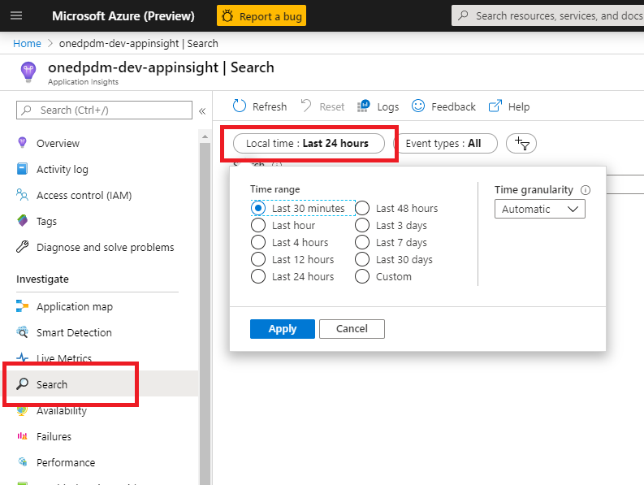

# Microsoft Application Insights Aras Plugin

### About

The Microsoft Application Insights Aras Plugin is a tool that allows administrators of an Aras instance to instrument and monitor Methods run inside Aras.

Once installed, all Aras Methods will log a detailed waterfall graph of their execution time into Application Insights.

Included in this repository are

* Updated method-config.xml file, which will instrument all Methods being run.
* C# project which is needed in conjunction with the updated method-config.xml file.
* Pre-compiled DLL from the C# project.

## Installation

### Supported versions of Aras

* This can be installed on all versions of Aras as long as they use the method-config.xml file.

### Pre-requisites:
* Installed Aras instance
* .NET Framework 4.7.2
* An Application Insights instance with corresponding Instrumentation Key

### Steps
On your installation of Aras, copy the updated method-config.xml to your Innovator/Server/ directory. 

If your installation does not use an out-of-the-box version of the method-config.xml file, this file will need to be merged.

Copy the contents from Innovator/Server/bin/ to the same folder in your Aras installation.

Open the `InnovatorServerConfig.xml` file. Add the following two operating_parameters:

	<operating_parameter key="AppInsightKey" value="{Fill with your App Insights instrumentation key}"/>
	<operating_parameter key="IsTelemetryEnable" value="true"/>

File should end up looking something like the following:

#### method-config.xml merge steps [only needed if the method-config.xml has been previously modified]
If you need to merge the method-config.xml, follow the following instructions.

Add the following to the ReferencedAssemblies tag.

	<name>$(binpath)/Microsoft.ApplicationInsights.dll</name>
	<name>$(binpath)/Microsoft.ApplicationInsights.ArasPlugin.dll</name>

In the `CSharp` Template, add the following `using` statement.

`using Microsoft.ApplicationInsights;`

In the `CSharp` Template, add the following before the methodCode calls

    Microsoft.ApplicationInsights.Extensibility.IOperationHolder<Microsoft.ApplicationInsights.DataContracts.RequestTelemetry> operation = null;
    if (Microsoft.ApplicationInsights.ArasPlugin.Telemetry.IsEnable)
      operation = Microsoft.ApplicationInsights.ArasPlugin.Telemetry.TelemetryClient.StartOperation<Microsoft.ApplicationInsights.DataContracts.RequestTelemetry>(this.GetType().ToString());
    try
    {

Add the following immediately after the methodCode calls

    }
    catch (Exception ex)
    {
      Microsoft.ApplicationInsights.ArasPlugin.Telemetry.TelemetryClient.TrackException(ex);
      throw;
    }
    finally
    {
      if (operation != null)
        Microsoft.ApplicationInsights.ArasPlugin.Telemetry.TelemetryClient.StopOperation(operation);
    }

The file should end up looking like this:

## Example Methods and their timings sent to Application Insights

Login to the Aras instance, create a test Method or two. In these examples I have one Method calling another to illustrate the waterfall graph which will be displayed in Application Insights.

### test\_method\_1

	Innovator inn = this.getInnovator();
	Item res = inn.applyMethod("test_method_2", "");
	res = inn.applyMethod("test_method_3", "");
	return this;

### test\_method\_2

	Innovator inn = this.getInnovator();
	System.Threading.Thread.Sleep(500);
	Item res = inn.applyMethod("test_method_3", "");
	System.Threading.Thread.Sleep(500);
	res = inn.applyMethod("test_method_3", "");
	return this;

### test\_method\_3

	Innovator inn = this.getInnovator();
	System.Threading.Thread.Sleep(500);
	return this;

Now, run the Method test\_method\_1 using the 'Run Server Method' Action.

After a short delay, the Method will complete, and will send the Method calls to Application Insights.

Login to the [Azure Portal](https://portal.azure.com) and navigate to your Application Insights.

In your Application Insights blade, navigate to Search and then narrow the window down to the last 30 minutes.

Open the one for test\_method\_1.

Here is a more complex example taken from production data

